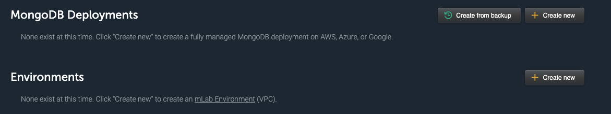
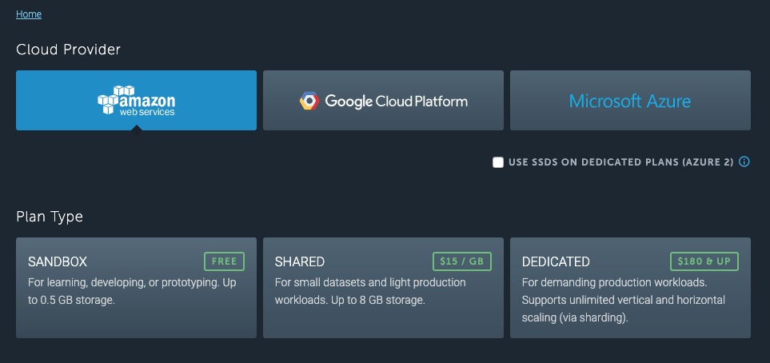
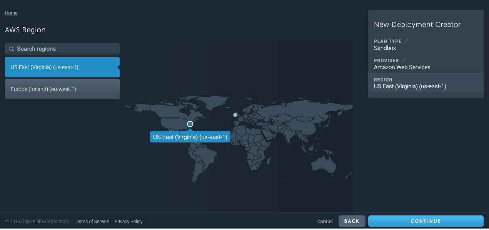
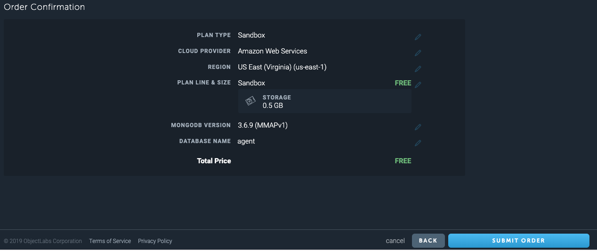
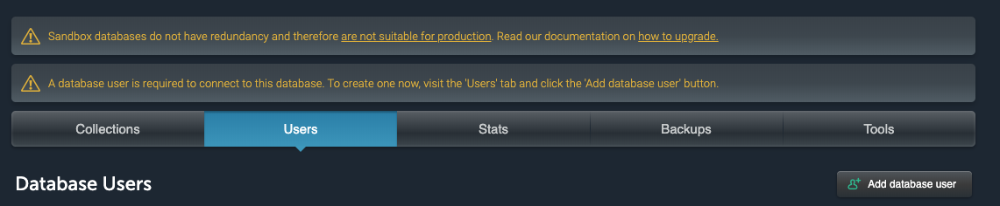
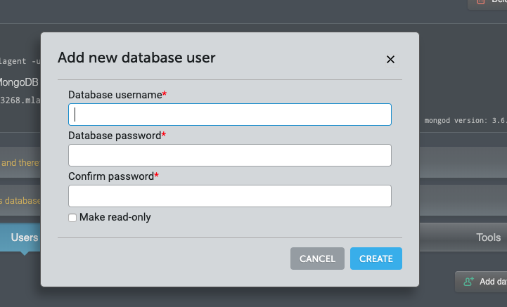

# Travel Agent Sync

**[UNDER CONSTRUCTION]**

## Setting Up a Database

Let's use [MLAB](https://mlab.com/home), it's free!

Select a cloud provider of your choosing, Amazon, Google Cloud,or Azure.

Then select the plan, Sandbox followed by clicking the CONTNUE button on the lower right.

Select a region that works for you followed by clicking the CONTNUE button on the lower right.

Enter the name of one of the 5 databases were going to create, `airline`, `auto`, `hotel`, `user` or `agent`.
Then click the CONTNUE button on the lower right.

Then click the SUBMIT ORDER button on the lower right.

You'll the database listed. Click the database entry. 

You'll see tabs for `Collections`, `Users`,`Stats`, `Backups` and `Tool`. 

Click the `Users` button.

You'll be presented with the, `Add new database user` dialog.

Add a user. In this case we're creating the user `travelagent`. This user will be applied
to all the databases we'll create subsequently.

Also, add a password for the user. Then, click the CREATE button.

The user is now created for the database.

Use the process to create the databases, `airline`, `auto`, `hotel`, `user` and `agent`. Create
the same user, `travelagent`, with the same `password` for all the databases.

## About the Database URL

The way you'll authenticate to the database from a MongoDB client is according to the following
URL format:

`mongodb://<dbuser>:<dbpassword>@ds235378.mlab.com:35378/hotel`

**WHERE**

* `<dbuser>` is the name of the database user
* `<dbpassword>` is the user's password
* `@ds235378.mlab.com:35378/hotel` is a URL special the the database. In this case the `url`
describes the database, `hotel`.