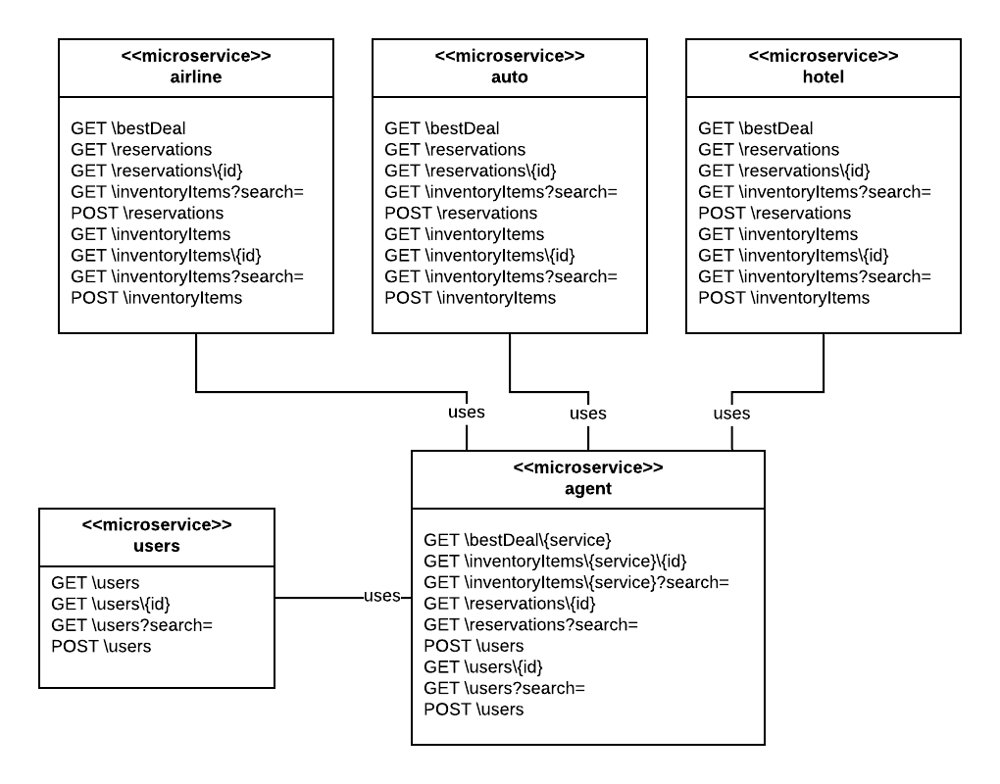

# Setting Up the Synchronous Version of the Travel Agent MOA to Run Under Minikube

**(MOA = Microservices Oriented Architecture)**



In order to work with the example, you'll need to set up a mongdb database somewhere that is accessible from
the cloud. This example uses the `mongodb` cloud service,  [`mlab`](https://mlab.com). `mlab` offers free sandboxes
for educational purposes.

You're going to have to set up 5 databases, `airline`, `auto`, `hotel`, `user` and `agent`. You'll find
detailed, illustrated instructions for setting up these databases [here](mlab-setup.md).

---- 

Before you start, please be advised that the MOA is running inside a Kubernetes cluster. The current state of the code is that the microservices are running
internal to Kubernetes. Hence, the application is facilitating internal "travel" behavior.

---- 

**Step 1**: Go to a Minikube playground on Katacoda

(You might have to login or create an account)

`https://katacoda.com/javajon/courses/kubernetes-fundamentals/minikube`

**Step 2**: Load in this source code

`git clone https://github.com/reselbob/travelagent.git`

**Step 3**: Navigate to the synchronous version of the MOA

`cd travelagent/sync/`

**Step 4**: Run the shell script the creates a local Docker registry and seed the registry
with the containers representing each microservice 

`sh docker-seed.sh`

**Step 5**: Add your `mLab` authentication data to the Kubernetes secret manifest file,
 `travelagent/sync/kubernetes/manifests/travelagent-secret.yaml`;
 
 **BE ADVISED!!!** Step 5 is a critial step. **If you don't configure access information to mLab in
 the secret properly**, the application will not work.
 
 The following shows the "placeholder" secret manifest, `travelagent-secret.yaml` for the application.
 
 ```yaml
apiVersion: v1
kind: Secret
metadata:
  name: travelagent-data
type: Opaque
data:
  agenturl: xxxxxxx
  autourl: xxxxxxx
  airlineurl: xxxxxxx
  hotelurl: xxxxxxx
  usersurl: xxxxxx
```

You are going to enter the MongoDB (mlab) url with user and password for each database that backs
the particular Travel Agent service. Again, this is really important. Do not hesitate to ask the
instructor for help. Configuring the secret properly is a critical path item.

**Step 6**: Install the Kubernetes artifacts

`sh kubernetes/generate-k8s-resources.sh`

**Step 7**: Go to a new terminal window in Katacoda and find out the id's of the pods that make up the various deployments.

`kubectl get pods`

**Step 8**: Start start up a log stream against the `agent` pod.

`kubctl logs agent-<UNIQUE_ID> -f`

**Step 9**: Go back to the first terminal window. Find out the NodePort of the `agent` service.

`kubectl get services`

You'll get output similar to the following:

**Step 10**: Find the IP address of the cluster

`kubectl cluster-info`

**Step 11**: Call the `bestDeal` endpoint the `agent` service exposes using a `curl` command like so:

In this case we'll get the Best Deal from the airline

`curl IP_OF_CLUSTER:NODE-PORT/bestDeal/airline`

You'll get output similar to the following:

```json
{
	"data": {
		"data": {
			"flightNumber": 657,
			"from": "ANC",
			"to": "JFK",
			"airline": "SPIRIT",
			"departure": "2019-10-30T23:22:59.825Z",
			"arrival": "2019-10-30T23:22:59.825Z",
			"price": 273
		},
		"agent": "Way Cool Travel Agent"
	}
}
```

Now get the best deal from the `hotel` microservice.

`curl IP_OF_CLUSTER:NODE-PORT/bestDeal/hotel`

You'll get output similar to the following:
```json
{
	"data": {
		"data": {
			"property": {
				"address_1": "21509 Joe Park",
				"address_2": "Apt. 777",
				"city": "West Arnaldoville",
				"state_province": "MD",
				"postal_code": "68724-7233",
				"country": "USA",
				"phone": "1-629-322-8881 x80187"
			},
			"vendor": "HILTON",
			"checkIn": "2019-10-17T23:22:19.703Z",
			"checkOut": "2019-10-31T23:22:19.703Z",
			"price": 1652
		},
		"agent": "Way Cool Travel Agent"
	}
}
```

Finally  get the best deal from the `auto` microservice.

`curl IP_OF_CLUSTER:NODE-PORT/bestDeal/auto`

You'll get output similar to the following:

```json
{
	"data": {
		"data": {
			"auto": {
				"make": "Audi",
				"model": "5000",
				"year": "2017-01-01T00:00:00.000Z"
			},
			"vendor": "ENTERPRISE",
			"checkIn": "2019-10-17T23:22:04.571Z",
			"checkOut": "2019-10-31T23:22:04.571Z",
			"price": 168
		},
		"agent": "Way Cool Travel Agent"
	}
}
```